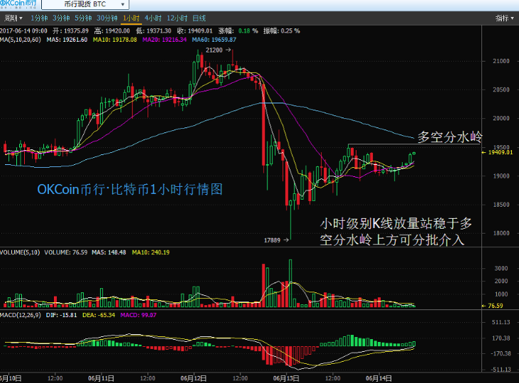

# 投资加密货币ICO的好处与坏处
发布于 2017-06-29 作者 Jay
___
>*好处：可能一夜暴富；坏处：可惜不是你*

 **“首次代币发行（ICO）”近日异常火爆。Bancor在短短几个小时之内就融资15300万美元。Status.im也至少融资6400万美元。这两个项目都引发了极大的市场热情，甚至都阻塞了底层的网络。聊天工具的初创企业Kik也计划在今年发起ICO。根据CoinDesk最近一份研究报告，截至2017年6月9日，区块链初创企业已经通过ICO融资超过32700万美元，超过了VC融资的29500万美元。**

顾名思义，ICO是受到了IPO的启发，尽管实践中双方有很大区别。何为ICO？一言以蔽之，ICO就是区块链初创企业的一种融资方式。投资者购买代币—数字货币的单位—这通常意味着是创业公司希望构建的应用程序的组成部分。赌注就是这一应用程序会得到广泛应用，其代币需求量会因此增多，价值上升，到目前为止，大多数ICO都是基于以太坊，以太坊与比特币类似，但同时还可以用于“智能合约”。

在该领域有大量的资金存在，且大部分来自中国。但来自全世界的投资者都想参与其中，希望能成为有望成为下一个谷歌或Facebook的初创企业的“股东”。而同时也有批评者指出，ICO可能会逃避SEC的监管，或者说ICO虽然有发展潜力，但当前ICO热是一种泡沫。

让我们切入正题：你是否应该投资ICO？这是否是迅速暴富的一种好方法？对于大部分ICO项目来说，答案是否定的，但与Betteridge’s law（该法则意思是对于任何以问号结尾的问题，都可以用no来回答）相反，也有ICO项目的答案是肯定的。投资ICO可能会有高回报率，但购买加密货币也面临着风险，投资ICO风险更大。作为投资的积极参与者，以自己实际经济能力参与ICO是明智之举。

尽管如此，如果1）一个项目从商业上讲得通和2）证实对该项目有需求，和3）这种商业需要加密货币代币系统才能工作，和4）承付款项没有困难，那么就尽管去投。如果你认为自己天生多疑，不管一种资产的基础价值如何，那就不要去投。（然而，即使你认为是这样的也不一定是真的，最专业的股票交易者也没有战胜市场。）

尽管如此，明白买进ICO与买进股票不同是非常重要的，如果你购买股票，你从字面上已经购买了公司的一部分。同时，股票受到监管部门的监管，也会有信托义务的责任，也会有资质要求。法律基础设施最终会抵达加密货币，但至少目前还没有触及。

然而，正如Investopedia指出：“早期投资者通常被激励购买加密代币，希望这一项目能够成功，并实现升值。”

除此之外，一个典型的ICO公司通常会建个网站，并发布一份白皮书，但没有功能产品。风投（VC）界的共识是，对于一个初创企业，太快的融资过多资金不是一件好事。
***
© 本站文章除注明转载/出处外，均为本站原创或翻译，转载前请务必署名,转载请标明出处  
最后编辑时间为: 2017/06/29 10:45
